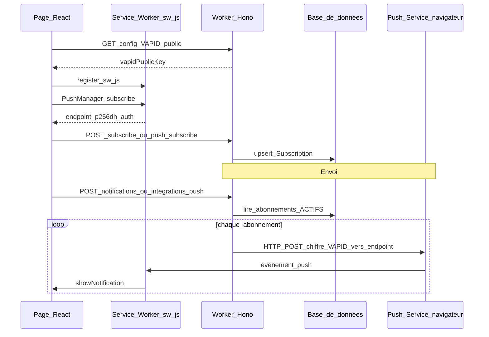

# Notifications push dans ce projet

Ce document explique **comment les notifications push web fonctionnent ici**, et en quoi cela diffère d’une intégration **Firebase Cloud Messaging (FCM)** « classique » (SDK, clé serveur Firebase, console Firebase).

## En une phrase

L’application utilise le **standard Web Push** (Push API + protocole Web Push) avec des clés **VAPID**. Le serveur envoie un message chiffré en **HTTP vers l’URL `endpoint`** fournie par le navigateur. Sur Chrome, cette URL passe souvent par **Google (FCM) comme relais**, mais **sans** utiliser le SDK Admin Firebase ni une clé API FCM au sens habituel.

## Vue d’ensemble du flux

Les rôles :

- **Page React** : demande la permission, récupère la clé publique VAPID, appelle `PushManager.subscribe`, envoie les clés au Worker.
- **Worker (Hono)** : stocke les abonnements, construit les messages Web Push, appelle l’`endpoint`.
- **Push service du navigateur** : pour Chrome, c’est en pratique l’infrastructure Google (souvent visible dans l’URL de l’`endpoint`) ; pour Firefox, Mozilla ; pour Safari, le service Apple — **le code de ce dépôt ne cible pas un fournisseur en particulier**, il suit le standard.
- **Service worker** : reçoit l’événement `push`, affiche la notification et gère le clic.

## Inscription (subscribe)

### 1. Permission et service worker

Le flux commence dans [`src/react-app/lib/pushSubscription.ts`](../src/react-app/lib/pushSubscription.ts) :

- Vérification du support (`Notification`, `serviceWorker`, `PushManager`).
- Demande de permission si nécessaire (`ensureNotificationPermissionForPush`).
- Vérification que `/sw.js` est bien du JavaScript (évite le piège du fallback SPA qui renvoie du HTML).

### 2. Clé publique VAPID

La page appelle `loadConfig(roomName)` ([`src/react-app/services/api.ts`](../src/react-app/services/api.ts)), qui interroge :

`GET /v1/rooms/:roomName/config`

La route est définie dans [`src/worker/routes/rooms.ts`](../src/worker/routes/rooms.ts). Le Worker renvoie notamment `vapidPublicKey` issu de la variable d’environnement `VAPID_PUBLIC_KEY` (après validation).

**VAPID** (*Voluntary Application Server Identification*) permet au push service de savoir **quel serveur d’application** envoie les messages, sans partager le même modèle d’authentification que Firebase pour les apps mobiles.

### 3. `PushManager.subscribe`

Toujours dans `pushSubscription.ts`, le navigateur :

1. Enregistre le service worker [`public/sw.js`](../public/sw.js) avec le scope `/`.
2. Appelle `registration.pushManager.subscribe({ userVisibleOnly: true, applicationServerKey: ... })` avec la clé publique VAPID (format attendu par l’API Web Push).

Le navigateur renvoie un objet d’abonnement contenant au minimum :

- **`endpoint`** : URL unique vers laquelle le serveur doit poster les messages pour **ce** navigateur.
- **`keys.p256dh`** et **`keys.auth`** : matériel de chiffrement pour que seul ce client puisse déchiffrer le corps du message.

### 4. Enregistrement côté serveur

Les clés sont envoyées au Worker selon le contexte :

| Contexte | Route | Fichier client |
|-----------|--------|----------------|
| Après avoir rejoint une salle (avec `memberId` connu) | `POST /v1/rooms/:roomName/subscribe` | `subscribeDevice` dans `api.ts` |
| Tableau de bord / session JWT (le serveur résout le membre) | `POST /v1/rooms/:roomName/push-subscribe` | `subscribeDeviceWithUserToken` dans `api.ts` |

Le schéma JSON est validé côté Worker ; la persistance suit le modèle **`Subscription`** dans [`prisma/schema.prisma`](../prisma/schema.prisma) (`endpoint` unique, `p256dh`, `auth`, lien `room` / `member`, statut `ACTIVE` ou plus tard `INVALID`).

## Envoi d’une notification

Deux façons principales de déclencher un envoi (voir [`src/worker/routes/rooms.ts`](../src/worker/routes/rooms.ts)) :

1. **`POST /v1/rooms/:roomName/notifications`** — avec en-tête `Authorization: Bearer …` (utilisateur connecté au dashboard).
2. **`POST /v1/rooms/:roomName/integrations/push`** — avec l’en-tête `X-Room-Integration-Secret` (automation type n8n).

La logique métier d’envoi est dans [`src/worker/services/pushService.ts`](../src/worker/services/pushService.ts) :

- Création d’un enregistrement `Notification`.
- Lecture de tous les abonnements **`ACTIVE`** pour la salle.
- Pour chaque abonnement, appel à [`src/worker/lib/webPushSend.ts`](../src/worker/lib/webPushSend.ts) : construction du message (chiffrement + JWT VAPID) puis **`fetch(endpoint, { method, headers, body })`**.
- Journalisation dans `DeliveryLog` ; sur réponse **404 ou 410**, l’abonnement est marqué **`INVALID`** (jeton expiré ou désinscription côté navigateur).

## Réception dans le navigateur

[`public/sw.js`](../public/sw.js) :

- Écoute **`push`** : lit `event.data` comme JSON (`title`, `body`, `url`, `tag`) et appelle `showNotification`.
- Écoute **`notificationclick`** : ouvre ou focus une fenêtre et navigue vers `url`.

Le corps du message est donc un **JSON applicatif** chiffré dans le tunnel Web Push ; le service worker le déchiffre via les APIs du navigateur avant d’afficher la notification.

## Configuration opérateur (Worker)

Les secrets VAPID sont lus depuis l’environnement du Worker (types dans [`src/worker/types.ts`](../src/worker/types.ts)) :

| Variable | Rôle |
|----------|------|
| `VAPID_PUBLIC_KEY` | Clé publique P-256 (point non compressé, base64url), exposée au client via `/config`. |
| `VAPID_PRIVATE_JWK` | JWK JSON contenant au minimum le champ secret **`d`** (voir commentaires dans `webPushSend.ts`). |
| `VAPID_SUBJECT` | Identité du serveur d’application (souvent `mailto:…` ou URL `https://…`). |

L’implémentation d’envoi utilise **`@block65/webcrypto-web-push`** (compatible Workers : Web Crypto + `fetch`, sans pile Node `jws` / `web-push` classique). Les détails du format des clés sont documentés en tête de [`src/worker/lib/webPushSend.ts`](../src/worker/lib/webPushSend.ts).

## Web Push + VAPID (ce dépôt) vs FCM « Firebase classique »

| | Ce projet (Web Push) | FCM « classique » (souvent apps natives / Firebase) |
|--|----------------------|-----------------------------------------------------|
| **Cible** | Navigateur + service worker (PWA / site web) | Souvent SDK Android/iOS ou API REST FCM dédiée |
| **Identité serveur** | Paire de clés **VAPID** (JWT dans les en-têtes HTTP Web Push) | **Clé serveur** / compte de service / projet Firebase |
| **Adresse d’envoi** | URL **`endpoint`** fournie par chaque abonnement navigateur | Endpoints API Google FCM selon le type de message |
| **Lien avec Google** | Indirect sur Chrome (FCM comme push service du navigateur) | Direct (projet Firebase, console, quotas FCM) |

**À retenir** : si vous voyez une URL d’`endpoint` contenant `google` ou `fcm`, c’est **normal** pour Chrome — ce n’est pas pour autant que cette codebase envoie des messages « au format FCM Admin » ; elle envoie des messages **Web Push standard** que le push service de Chrome sait relayer jusqu’au service worker.

## Fichiers utiles (référence rapide)

| Sujet | Fichier |
|--------|---------|
| Client : permission, subscribe, appels API | [`src/react-app/lib/pushSubscription.ts`](../src/react-app/lib/pushSubscription.ts) |
| Client : `loadConfig`, `subscribeDevice` | [`src/react-app/services/api.ts`](../src/react-app/services/api.ts) |
| Service worker : `push`, clic | [`public/sw.js`](../public/sw.js) |
| Routes HTTP chambres / push | [`src/worker/routes/rooms.ts`](../src/worker/routes/rooms.ts) |
| Boucle d’envoi + logs | [`src/worker/services/pushService.ts`](../src/worker/services/pushService.ts) |
| Chiffrement + `fetch` vers `endpoint` | [`src/worker/lib/webPushSend.ts`](../src/worker/lib/webPushSend.ts) |
| Modèle de données | [`prisma/schema.prisma`](../prisma/schema.prisma) (`Subscription`, `Notification`, `DeliveryLog`) |

---

Pour les limites et bonnes pratiques Cloudflare Workers, voir [`AGENTS.md`](../AGENTS.md) à la racine du dépôt.
